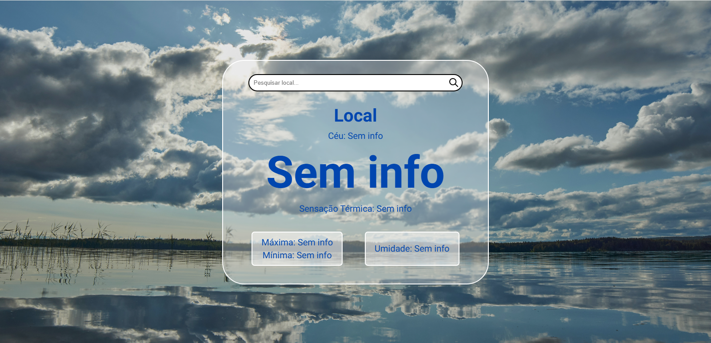

# 🌤️ Weather App

Aplicação web de previsão do tempo desenvolvida com **JavaScript puro**, consumindo a API OpenWeather para exibir dados climáticos em tempo real.

---

## 🌐 Acesse o projeto
https://weather-app-bay-two-bbnbyqcbiv.vercel.app/

---

## 🚀 Funcionalidades

* 🔍 Busca de cidades em tempo real
* 🌡️ Exibição da temperatura atual
* 🤒 Sensação térmica
* 📉 Temperatura mínima e máxima
* ☁️ Descrição do clima
* 💧 Umidade do ar

---

## 🛠️ Tecnologias utilizadas

* HTML5
* CSS3
* JavaScript (Vanilla JS)
* API OpenWeather

---

## 📸 Preview

> Adicione aqui um print do seu projeto
> Exemplo:
>
> 

---

## 📄 Licença

Este projeto está sob a licença MIT.

---

## 🧑‍💻 Autor

Luciano Nóbrega Alves de Oliveira
